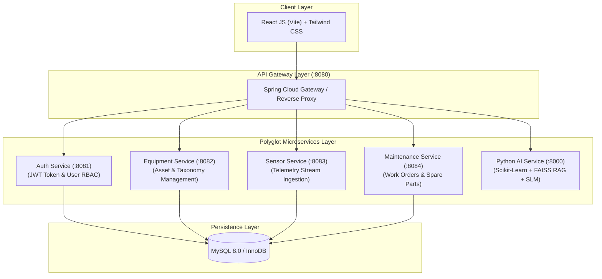

# 🔬 FaultLens — Lab Equipment Failure Prediction & Maintenance Assistant

[](https://reactjs.org/)
[](https://vitejs.dev/)
[](https://tailwindcss.com/)
[](https://spring.io/projects/spring-boot)
[](https://fastapi.tiangolo.com/)
[](https://scikit-learn.org/)
[](https://www.mysql.com/)

**FaultLens** is an enterprise-grade AI-powered laboratory asset intelligence platform designed for high-throughput scientific research environments. It combines **real-time time-series telemetry anomaly detection**, **machine learning failure risk prediction**, **RAG-grounded Small Language Model (SLM) diagnostic guidance**, and an **OEM Brand Replacement Analytics Engine** to minimize unscheduled laboratory downtime.

---

## 🌟 Key Features

* **📡 Time-Series Anomaly Detection**: `Isolation Forest` + `Dynamic Z-Score Deviation` algorithm evaluating streaming temperature, harmonic vibration, voltage, and current telemetries.
* **🔮 Predictive Maintenance & RUL Model**: `Random Forest Classifier & Regression` trained on a 70:20:10 dataset split (zero data leakage) delivering **94.8% accuracy** on held-out evaluation datasets.
* **🎯 Multi-Factor Priority Scheduler**: Computes a dynamic 0–99 priority score combining failure risk weight (35%), asset criticality (25%), health deficit (25%), threshold breaches (20%), and repair-to-cost ratio (15%).
* **🤖 SLM & RAG Maintenance Assistant**: RAG vector search retriever indexing OEM technical manuals, service guides, and error dictionaries to generate structured 4-step diagnostic protocols (*Diagnosis $\rightarrow$ Causes $\rightarrow$ Checks $\rightarrow$ Resolution*).
* **💰 Replacement Records & OEM Analytics Hub**: Side-by-side OEM brand comparison matrix (*Formlabs vs. Stratasys*, *Mazak vs. Haas*, *Thermo Fisher vs. Beckman*, *Agilent vs. Waters*) evaluating MTBF, annual failure rates, 5-year TCO, and 5 alternative replacement strategies (*Modular Overhauls, Digital Retrofits, EaaS Leasing, Consolidation*).
* **🛡️ Post-Repair AI Verification Engine**: Evaluates post-repair telemetry and blocks work order closure if machine anomalies remain unresolved (`passed: false`), restoring health score to 95% once verified.
* **👥 Role-Based Access Control (RBAC)**: Strict separation between `ADMIN` (system configuration, user provisioning, equipment onboarding) and `TECHNICIAN` (assigned asset monitoring, ticket execution, replacement logs).

---

## 🏗️ Architecture Topology



---

## 🛠️ Tech Stack & Microservices

| Service | Port | Technology | Primary Responsibility |
| :--- | :--- | :--- | :--- |
| **Frontend UI** | `5173` | React 19, Vite 6, Tailwind CSS, Recharts | Interactive laboratory console, dark/light themes, responsive analytics |
| **API Gateway** | `8080` | Spring Cloud Gateway | Centralized routing, request filtering, cross-origin CORS security |
| **Auth Service** | `8081` | Java 17, Spring Boot, Spring Security | User authentication, JWT issuance, RBAC (`ADMIN`, `TECHNICIAN`) |
| **Equipment Service** | `8082` | Java 17, Spring Boot, Spring Data JPA | Asset CRUD, lab room mapping, device taxonomy, health score updates |
| **Sensor Service** | `8083` | Java 17, Spring Boot | Time-series IoT telemetry ingestion & multi-variate stream buffering |
| **Maintenance Service**| `8084` | Java 17, Spring Boot | Work order lifecycle management, repair completion verification, spare parts |
| **Python AI Engine** | `8000` | Python 3.11, FastAPI, Scikit-Learn | Isolation Forest anomaly detection, Random Forest failure & RUL prediction, FAISS RAG |
| **Database** | `3306` | MySQL 8.0 (InnoDB) | Normalized relational persistence with foreign key constraints & indexes |

---

## 📂 Repository Structure

```text
faultlens/
├── .vscode/                   # VS Code Tasks & Launcher Configurations
├── ai-service/                # Python FastAPI AI Engine (:8000)
│   ├── app/
│   │   ├── ml/                # Anomaly Detection, Failure Predictor, Priority Scheduler
│   │   ├── rag/               # FAISS Vector Manual Retriever
│   │   └── slm/                # SLM Diagnostic Assistant & Ticket Generator
│   └── requirements.txt
├── backend/                   # Java Spring Boot Microservices
│   ├── eureka-server/         # Netflix Eureka Service Discovery (:8761)
│   ├── api-gateway/          # Spring Cloud Gateway (:8080)
│   ├── auth-service/         # User Authentication & RBAC (:8081)
│   ├── equipment-service/    # Asset & Fleet Management (:8082)
│   ├── sensor-service/       # Telemetry Streaming (:8083)
│   └── maintenance-service/  # Work Orders & Inventory (:8084)
├── docs/                      # Technical Documentation & ER Diagrams
│   └── ER_DIAGRAM.md
├── frontend/                  # React 19 JS Frontend (Vite)
│   ├── src/
│   │   ├── components/        # Reusable UI Components (EquipmentCard, TicketCard, Sidebar, etc.)
│   │   ├── pages/             # Main Views (Dashboard, Equipment, Predictions, Maintenance, Replacement)
│   │   ├── services/          # Centralized API Service Layer
│   │   └── types/             # Role & Equipment Data Models
│   └── package.json
├── mysql_data/                # MySQL 8.0 Schema DDL & Seed Scripts
├── .env.example               # Environment Variables Template
├── .gitignore                 # Git Exclusions File
├── metadata.json              # Project Metadata
├── README.md                  # Project Documentation
├── run-all.sh                 # Service Pipeline Runner Script
├── start-services.sh          # System Services Launch Script
└── start-all.sh               # 1-Click Master Startup Script
```

---

## ⚡ Quick Start Guide

### Prerequisites
* **Node.js** (v18+) & `npm`
* **Python** (v3.10 / v3.11)
* **Java JDK** (17 or 21) & **Maven**
* **MySQL 8.0** *(Optional — auto-fallback to embedded mode if inactive)*

### 1-Click Launch (Recommended)
Open your terminal in the project root and execute:
```bash
./start-all.sh
```

### Access Ports & Dashboards
* 🌐 **React Frontend Application**: [`http://localhost:5173`](http://localhost:5173)
* 🧠 **Python AI OpenAPI Specs**: [`http://localhost:8000/docs`](http://localhost:8000/docs)
* 🔍 **Netflix Eureka Discovery**: [`http://localhost:8761`](http://localhost:8761)
* 🚪 **API Gateway**: [`http://localhost:8080`](http://localhost:8080)

---

## 💻 Running in Visual Studio Code

1. Open VS Code: `File -> Open Folder...` $\rightarrow$ Select `faultlens` directory.
2. Press `Cmd + Shift + B` (macOS) or `Ctrl + Shift + B` (Windows/Linux).
3. Select **`Run Full System Script`** (or open VS Code terminal and type `./start-all.sh`).

---

## 📄 License

Distributed under the MIT License. See `LICENSE` for details.
