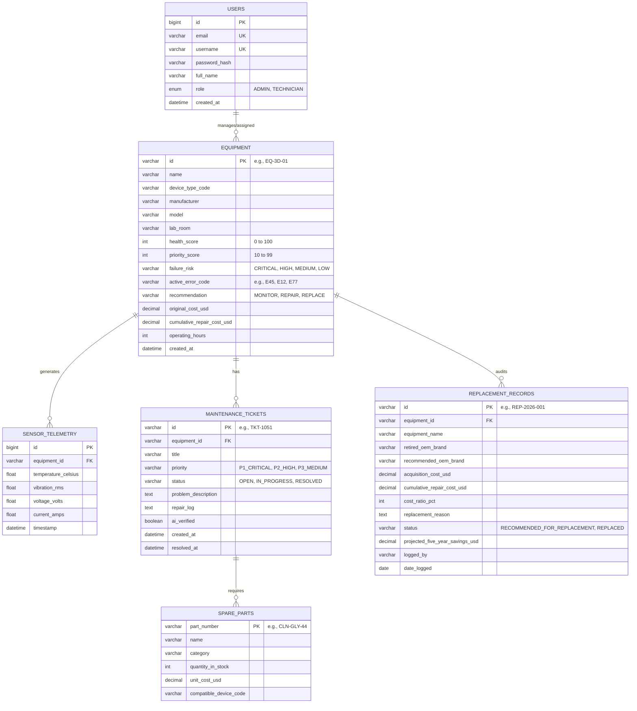

# 🗄️ FaultLens — Entity Relationship (ER) Diagram & Schema Documentation

The **FaultLens** database (`faultlens_db` / `fault_lens`) is implemented on **MySQL 8.0** with normalized tables, primary keys, foreign key relationships, and indexes.

---

## 📐 ER Diagram (Mermaid Topology)

---

## 🗃️ Database Table Definitions

### 1. `users`
* Primary User Store with Role-Based Access Control (`ADMIN` vs `TECHNICIAN`).

### 2. `equipment`
* Central asset register tracking health score, active error code, failure risk classification, and cumulative repair cost ratio.

### 3. `sensor_telemetry`
* High-frequency time-series buffer storing temperature, vibration, voltage, and current streams.

### 4. `maintenance_tickets`
* Work orders lifecycle tracking ticket status (`OPEN` $\rightarrow$ `IN_PROGRESS` $\rightarrow$ `RESOLVED`) and AI post-repair verification flags.

### 5. `spare_parts`
* Laboratory consumable and replacement parts inventory with unit costs and stock levels.

### 6. `replacement_records`
* Financial audit ledger tracking retired equipment, recommended OEM models, cost ratios, and projected 5-year TCO savings.
